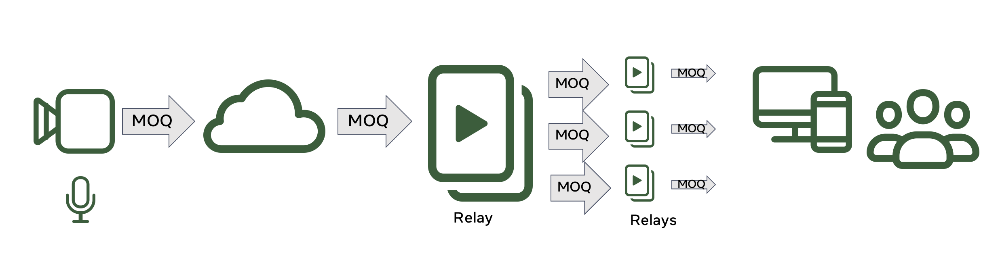

# moxygen

This is an experimental media MOQ relay (AKA: CDN node) based on [MOQT](https://datatracker.ietf.org/doc/draft-ietf-moq-transport/). It can be used in conjunction with following live encoder and player [moq-encoder-player](https://github.com/facebookexperimental/moq-encoder-player). Both repos allows us create a live streaming platform where we can control latency and quality (and others), so we can test scenarios from ultra low latency live (video call) to high quality (and high scale) live.


Fig1: Basic block diagram

In the following figure you can see an overview of the relay architecture

TODO
Fig2: Relay architecture overview


See also [ARCHITECTURE.md](https://github.com/facebookexperimental/moxygen/blob/main/ARCHITECTURE.md)

## Installation

- Set environment variables
```
eval $(./build/fbcode_builder/getdeps.py env --src-dir moxygen:. moxygen)
```

- Build it
```
./build/fbcode_builder/getdeps.py build moxygen
```

## Rebuild
If you need to modify the code and rebuild it, you can do:
```
./build/fbcode_builder/getdeps.py build moxygen --src-dir=.
```

Follwing cmd can be a little faster if you do not need to rebuilt dependencies:
```
./build/fbcode_builder/getdeps.py build moxygen --src-dir=. --no-deps
```

## Test preconditions
- Generate self signed certificate for the server applications
```
cd scripts
./create-server-certs.sh
```

### Get build directory
```
MOXYGEN_BUILD_PATH=`./build/fbcode_builder/getdeps.py show-build-dir moxygen`
```

### Test with date server

- Execute date server (from project root dir)
```
$MOXYGEN_BUILD_PATH/moxygen/samples/date/moqdateserver -port 4433 -cert ./certs/certificate.pem -key ./certs/certificate.key --logging DBG1
```

- Execute text client
```
$MOXYGEN_BUILD_PATH/moxygen/samples/text-client/moqtextclient --insecure --connect_url "https://localhost:4433/moq-date" --track_namespace "moq-date" --track_name "date"
```

Note: the `--insecure` flag is ONLY required to connect to servers with self-signed certificates, similar to `curl -k``. It should never be used in production

- You should see an output like:
```
I1007 12:05:46.516857 3558180 MoQTextClient.cpp:191] run
I1007 12:05:46.579533 3558180 MoQTextClient.cpp:250] Largest={29331065, 47}
47
48
49
50
51
52
53
54
55
56
57
58
59
ObjectStatus=3
int extension=1977
data extension=AQIDBAU=
2025-10-07 12:06:
0
1
2
```

## Test with media streamer and media receiver

To simplify testing MOQ at media level we added the following binaries to the repo `MoQFlvStreamerClient` and `MoQFlvReceiverClient`.


Fig3: MoQFlvStreamerClient, MoQFlvReceiverClient, and moxygen

- `MoQFlvStreamerClient`: Convert any FLV (h264 / AAC-LC) file or stream (fifo) into MOQ, publishing it to a relay using MoqMi packager (see RFC [draft-cenzano-moq-media-interop](https://datatracker.ietf.org/doc/draft-cenzano-moq-media-interop/))

- `MoQFlvReceiverClient`: Subscribes to a relay for a video and audio track, demuxes them from MoqMi (expecting h264 / AAC-LC), transmuxes them to FLV and saves that to disc (or stream using fifo)

They work with FLV packager. Since [ffmpeg](https://www.ffmpeg.org/ffmpeg.html) is able to mux and / or demux this packager in low latency and real time very nice you can build a huge variety of tests set ups, for more information and examples take a look to [READMOQMEDIA.md](./READMOQMEDIA.md)

## Test with web media client
- You can use [moq-encoder-player](https://github.com/facebookexperimental/moq-encoder-player) as encoder (publisher), and also as player (consumer)

- You need to install that website ([moq-encoder-player](https://github.com/facebookexperimental/moq-encoder-player)) in a https server (apache2 recommended)
   - It will requiere to enable cross origin isolation (see [link](https://stackoverflow.com/questions/76077439/enabling-cross-origin-isolation-on-the-apache2-web-server)) on the player side

- To start the relay you can do (from project root dir)
```
$MOXYGEN_BUILD_PATH/moxygen/relay/moqrelayserver --cert ./certs/certificate.pem --key ./certs/certificate.key --endpoint "/moq" --logging=DBG1  --port 4433
```

## Local test with web media client

Assuming all running in localhost

- Execute (from project root dir)
```
$MOXYGEN_BUILD_PATH/moxygen/relay/moqrelayserver --cert [moq-encoder-player]/certs/certificate.pem --key [moq-encoder-player]/certs/certificate.key --endpoint "/moq" --logging=DBG4  --port 4433
```

Note: [moq-encoder-player] indicate the root directory of that project. So you need to use those certs to enable connections from Chrome to localhost

- Start client (MACOS)
Run MOQ encoder / player in the browser locally
   - Open a Chrome window and follow the instructions you will find in [moq-encoder-player](https://github.com/facebookexperimental/moq-encoder-player)


## License

moxygen is released under the [MIT License](https://github.com/facebookexperimental/moqxygen/blob/main/LICENSE).
