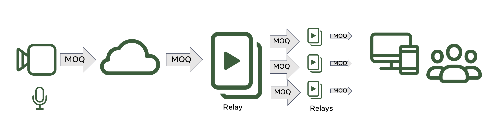

# moxygen

[](https://github.com/facebookexperimental/moxygen/actions/workflows/getdeps_linux.yml)
[](https://github.com/facebookexperimental/moxygen/actions/workflows/getdeps_mac.yml)
[](https://github.com/facebookexperimental/moxygen/actions/workflows/standalone.yml)

moxygen is a C++ implementation of [Media over QUIC Transport
(MoQT)](https://datatracker.ietf.org/doc/draft-ietf-moq-transport/). It provides a
library for building MoQT publishers, subscribers, and relays, along with a working
relay server, sample applications, and protocol conformance and interop tooling.

The library is transport-agnostic — WebTransport, raw QUIC, or QMUX-on-TCP —
coroutine-based, and built on [folly](https://github.com/facebook/folly),
[mvfst](https://github.com/facebook/mvfst), and
[proxygen](https://github.com/facebook/proxygen).



## Documentation

| Document | Contents |
|----------|----------|
| [QUICKSTART.md](./QUICKSTART.md) | Run a publisher, a relay, and a subscriber in a few minutes |
| [ARCHITECTURE.md](./ARCHITECTURE.md) | API model — control plane, data plane, sessions, threading |
| [READMOQMEDIA.md](./READMOQMEDIA.md) | Streaming real audio and video with ffmpeg and a browser player |
| [standalone/README.md](./standalone/README.md) | The CMake `FetchContent` build |
| [moxygen/moqtest/CONFORMANCE_README.md](./moxygen/moqtest/CONFORMANCE_README.md) | The conformance test suite |

## Protocol support

| Draft | Status |
|-------|--------|
| draft-18 | Supported, in experimental interop testing. |
| draft-16 | Supported. |
| draft-15 | Deprecated, scheduled for removal. |
| draft-14 | Deprecated, scheduled for removal. |

New integrations should target draft-16 until draft-18 interop testing completes.

Version negotiation happens over ALPN, using either standard (`moqt-NN`) or
Meta-specific ALPNs. The binaries accept `--versions` to restrict the offered set
(for example `--versions 16,18`); the default offers everything supported. See
[`moxygen/MoQVersions.h`](./moxygen/MoQVersions.h) for the version and ALPN constants.

## Repository layout

| Path | Contents |
|------|----------|
| `moxygen/` | Core library — session, framer, codec, types, consumers |
| `moxygen/relay/` | Relay, forwarder, cache, and the `moqrelayserver` binary |
| `moxygen/samples/` | Date server, text client, chat client, FLV streamer and receiver |
| `moxygen/moqtest/` | `moq-test-00` client and server, conformance suite, interop client |
| `moxygen/moq_mi/` | MoQ Media Interop packaging ([draft-cenzano-moq-media-interop](https://datatracker.ietf.org/doc/draft-cenzano-moq-media-interop/)) |
| `moxygen/flv_parser/` | FLV mux and demux used by the media samples |
| `moxygen/mlog/` | Structured protocol logging |

## Building

```
git clone https://github.com/facebookexperimental/moxygen.git
cd moxygen
```

There are two ways to build moxygen. Both read the same pinned dependency revisions
from `build/deps/github_hashes/`, so they produce the same versions of folly, fizz,
wangle, mvfst, and proxygen — they differ in what they build for you and what kind of
build tree you end up with.

| | Standalone CMake | getdeps |
|---|------------------|---------|
| Third-party dependencies | Must be installed first via `standalone/install-system-deps.sh` | Built or installed for you, including boost, zstd, double-conversion, and the rest |
| Meta dependencies | Fetched at the pinned revisions via CMake `FetchContent` | Built from the same pinned revisions |
| Build tree | An ordinary CMake tree you can point an IDE or `compile_commands.json` at | getdeps scratch directory; binaries under `show-inst-dir` |
| Building against a local dependency checkout | `FETCHCONTENT_SOURCE_DIR_<NAME>` substitutes your own folly, mvfst, proxygen, and so on | Not directly supported |
| Available in | The GitHub repo only — it needs `build/deps/github_hashes/` | The GitHub repo and fbsource |
| Covered by CI | `standalone` job | Linux and macOS jobs |

Use the standalone build if you want a normal CMake workflow, or you are co-developing
moxygen alongside a dependency. Use getdeps if you want the path most likely to work
unattended, or you are packaging moxygen. The Docker image below is not a third build
system — it runs getdeps inside a container and ships only the relay.

### Standalone CMake

Fetches the pinned dependency revisions using CMake's `FetchContent` and produces a
plain CMake build tree. See [standalone/README.md](./standalone/README.md) for
dependency overrides, build caching, and troubleshooting.

```
./standalone/install-system-deps.sh
cmake -B _build -S standalone -G Ninja
cmake --build _build -j$(nproc)
```

Binaries land in the build tree mirroring the source layout, for example
`_build/moxygen/relay/moqrelayserver` and
`_build/moxygen/samples/text-client/moqtextclient`.

Run the tests with:

```
ctest --test-dir _build
```

The first configure downloads roughly 500MB of dependency source. To avoid
re-downloading it on a clean build, set `-DFETCHCONTENT_BASE_DIR` to a shared location.

### getdeps

Builds moxygen and its Meta dependencies from the same pinned revisions, and also
builds or installs the third-party dependencies. This is the build exercised by the
Linux and macOS CI jobs, and the one the Docker image uses.

```
./build/fbcode_builder/getdeps.py install-system-deps --recursive moxygen
./build/fbcode_builder/getdeps.py build --allow-system-packages --src-dir=. moxygen
```

Once the dependencies are built, rebuild just moxygen with:

```
./build/fbcode_builder/getdeps.py build --src-dir=. --no-deps moxygen
```

Binaries are installed under:

```
MOXYGEN_BIN=$(./build/fbcode_builder/getdeps.py show-inst-dir moxygen)/bin
```

Run the tests with:

```
./build/fbcode_builder/getdeps.py test --src-dir=. moxygen
```

### Docker

Builds a container image running the relay server, and requires no local toolchain.
The header of [docker/Dockerfile](./docker/Dockerfile) documents the supported
environment variables and certificate mounts.

```
docker build -t moqrelay -f docker/Dockerfile .
docker run --rm -p 4433:4433/udp moqrelay
```

### Using moxygen from another CMake project

moxygen installs a CMake package. After building and installing, use
`find_package(moxygen REQUIRED)` and link the targets you need, such as
`moxygen::moxygen_moq` or `moxygen::moxygen_relay_moq_relay`. moxygen can also be
consumed directly via `FetchContent` or `add_subdirectory`.

## Testing and interop

- **Unit tests** — `getdeps.py test moxygen`, or `ctest --test-dir _build` for the
  standalone build.
- **Conformance suite** — 50 scenarios driving `moqtest_client` against a relay,
  covering forwarding preferences, group and object layouts, extensions, and
  end-of-group markers. See
  [CONFORMANCE_README.md](./moxygen/moqtest/CONFORMANCE_README.md).
- **`moqtest_server` and `moqtest_client`** — an implementation of the `moq-test-00`
  parameterized test protocol, for testing against other MoQT implementations.
- **Interop client** — `moxygen/moqtest/interop/`, exercised in CI by the
  `docker-interop-client` workflow.
- **`moqperf_test_client`** — throughput and latency measurement.

## Related projects

- [moq-encoder-player](https://github.com/facebookexperimental/moq-encoder-player) —
  a browser-based MoQT encoder and player built on WebCodecs. See
  [READMOQMEDIA.md](./READMOQMEDIA.md) for how to run it against moxygen.

## Contributing

Issues and pull requests are welcome. moxygen is developed inside Meta's monorepo and
mirrored to GitHub, so accepted changes land internally first and then appear here.

## License

moxygen is licensed under the Apache License 2.0. See [LICENSE](./LICENSE).
